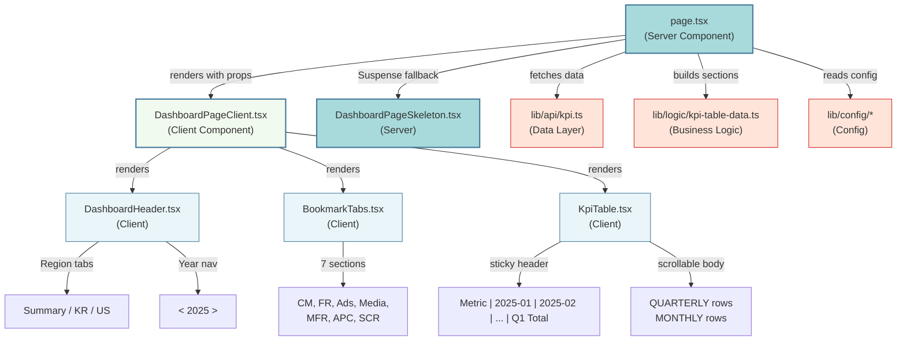

# Dashboard 구조 분석

> **Role:** Senior Next.js Architect  
> **Task:** `app/dashboard` 디렉토리 분석 및 고수준 구조 맵 생성  
> **Date:** 2026-02-17

---

## 1. 프로젝트 트리

### Dashboard 디렉토리 구조

```
app/(dashboard)/dashboard/
├── page.tsx                              # [SERVER] Root dashboard page (data fetching)
├── error.tsx                             # Error boundary
└── _components/
    ├── DashboardPageClient.tsx           # [CLIENT] Main orchestrator (state, filters, events)
    ├── DashboardHeader.tsx               # [CLIENT] Header with region tabs & year navigator
    ├── BookmarkTabs.tsx                  # [CLIENT] Vertical sidebar navigation (animated)
    ├── KpiTable.tsx                      # [CLIENT] Main data table (sticky headers, scrollable)
    ├── ControlBar.tsx                    # [CLIENT] (Legacy?) Filter toggle group
    └── DashboardPageSkeleton.tsx         # [SERVER] Loading skeleton

components/
├── ui/                                   # Shadcn/ui primitives
│   ├── table.tsx                        # Table components (base)
│   ├── button.tsx
│   ├── tabs.tsx
│   ├── toggle-group.tsx
│   ├── toggle.tsx
│   └── skeleton.tsx
└── common/                               # Shared reusable components (empty for now)

lib/
├── api/
│   └── kpi.ts                           # Data fetching layer (Supabase queries)
├── logic/
│   ├── kpi-table-data.ts                # Business logic: build table sections, compute aggregates
│   └── kpi-aggregation.ts               # Aggregation utilities
└── config/
    ├── categories.ts                    # Category metadata (CM, FR, Ads, Media, etc.)
    └── dashboard-sections.ts            # Dashboard section config (7 sections: CM, FR, Ads, Media, MFR, APC, SCR)
```

### 컴포넌트 책임

| 컴포넌트 | 타입 | 목적 |
|-----------|------|------|
| `page.tsx` | **Server** | 진입점; `fetchMonthlyKpi`로 데이터 페치, 테이블 섹션 빌드, 클라이언트에 전달 |
| `DashboardPageClient.tsx` | **Client** | 메인 오케스트레이터; 상태 관리 (필터, 스크롤 스파이, 연도 네비게이션), 헤더 + 탭 + 테이블 렌더링 |
| `DashboardHeader.tsx` | **Client** | Region 탭 (Summary/KR/US)과 Year Navigator (< 2025 >)가 있는 고정 헤더 |
| `BookmarkTabs.tsx` | **Client** | 7개 섹션을 위한 애니메이션 탭이 있는 세로 사이드바 (왼쪽 가장자리); 클릭 시 섹션으로 스크롤 |
| `KpiTable.tsx` | **Client** | Sticky 헤더(상단 + 좌측 컬럼), 가로/세로 스크롤, 요약 컬럼(Q1/Q2/Q3/Q4/Year)이 있는 대형 데이터 테이블 |
| `ControlBar.tsx` | **Client** | 가로 필터 토글 바 (현재 플로우에서는 미사용으로 보임?) |
| `DashboardPageSkeleton.tsx` | **Server** | Suspense 폴백 스켈레톤 |

---

## 2. 컴포넌트 계층 구조 (Mermaid 다이어그램)



### 범례
- **파란색 (Server Components):** 서버에서 실행, 직접 데이터 페치 가능, `"use client"` 불필요
- **연한 파란색 (Client Components):** 브라우저에서 실행, 훅/이벤트 사용, `"use client"` 필수
- **주황색 (Data/Logic Layers):** 순수 함수, UI 없음; Server Components에서 호출

---

## 3. 데이터 플로우

### 요청 플로우 (SSR + Client Hydration)

```
1. 사용자가 /dashboard?region=kr 요청
   ↓
2. page.tsx (Server Component)
   - searchParams 읽기
   - fetchMonthlyKpi(region: "kr") 호출 → Supabase
   - buildMonthlyTableSections(rows) 호출 → 데이터 처리
   - initialMonths, initialSections를 DashboardPageClient에 전달
   ↓
3. DashboardPageClient (Client Component)
   - 서버 데이터로 hydration
   - 로컬 상태 관리: activeFilter, activeScrollCategory, focusedYear
   - 렌더링: DashboardHeader, BookmarkTabs, KpiTable
   ↓
4. 사용자 인터랙션 (모두 클라이언트 사이드):
   - Region 변경 → updateUrl → 전체 페이지 리로드 (SSR 재실행)
   - Year nav → scrollToYear (클라이언트 사이드 스크롤, 리로드 없음)
   - Filter 클릭 → 섹션으로 스크롤 + 하이라이트
   - Bookmark 탭 클릭 → 섹션으로 스크롤
```

### 상태 관리 (Client)

| 상태 | 목적 | 범위 |
|------|------|------|
| `activeFilter` | 사용자가 선택한 카테고리 필터 (행 하이라이트) | `DashboardPageClient` 로컬 |
| `activeScrollCategory` | 현재 보이는 섹션 (스크롤 스파이) | `DashboardPageClient` 로컬 |
| `focusedYear` | Year Navigator 현재 값 | `DashboardPageClient` 로컬 |
| `region` | 서버 사이드 필터 (kr/us/summary) | URL searchParams → SSR |
| `useDashboardFilterStore` | Region용 Zustand 스토어 (컴포넌트 간 공유) | 전역 Zustand 스토어 |

---

## 4. 주요 아키텍처 패턴

### 4.1 Server-Client 분리
- **Server Component** (`page.tsx`)가 데이터 페칭을 처리하고, 직렬화 가능한 props를 클라이언트에 전달
- **Client Component** (`DashboardPageClient.tsx`)가 인터랙티비티, 상태, 렌더링 처리

### 4.2 Sticky Positioning
- **Header:** `sticky top-0` with `z-50` (항상 표시)
- **Table Header:** 스크롤 가능한 컨테이너 내부의 `sticky top-0 z-40` (세로 스크롤 시 고정)
- **Left Columns:** 더 높은 z-index를 가진 `sticky left-0`와 `sticky left-8` (가로 스크롤 시 고정)

### 4.3 스크롤 관리
- **Vertical Scroll Spy:** IntersectionObserver가 어떤 카테고리 섹션이 보이는지 추적
- **Horizontal Year Navigator:** 특정 연도 컬럼으로 테이블 스크롤 (예: `#col-year-2025`)
- **Smooth Scroll:** 섹션 네비게이션을 위한 `scrollIntoView({ behavior: "smooth" })`

### 4.4 데이터 변환 파이프라인
```
Supabase DB (ads_data_monthly)
  ↓ fetchMonthlyKpi (lib/api/kpi.ts)
Raw rows (MonthlyKpiRow[])
  ↓ buildMonthlyTableSections (lib/logic/kpi-table-data.ts)
Sections (MonthlyTableSection[])
  ↓ KpiTable (app/dashboard/_components/KpiTable.tsx)
QUARTERLY + MONTHLY 행이 렌더링된 테이블
```

---

## 5. 현재 이슈 및 관찰 사항

### 5.1 미사용 컴포넌트?
- `ControlBar.tsx`가 존재하지만 `DashboardPageClient.tsx`에서 **import되지 않음**
- 레거시 코드로 보임; 제거하거나 보존 이유를 문서화할 것을 고려

### 5.2 중복된 필터 UI
- **Bookmark 탭** (세로 사이드바)과 **카테고리 카드** (테이블 위 그리드) 모두 카테고리별 필터링
- UX 혼란을 야기할 수 있음; 통합 고려

### 5.3 Region 변경 동작
- `router.push()`를 통한 전체 페이지 리로드 (SSR) 트리거
- 더 빠른 전환을 위해 필요시 클라이언트 사이드 데이터 재페칭으로 최적화 가능

### 5.4 Z-index 계층 구조
- 복잡한 스택: header (50), table header (40), left columns (50), section headers (40)
- 작동하지만 신중한 관리 필요; 버그 방지를 위해 문서화 필요

---

## 6. 다음 단계 / 권장 사항

### 6.1 단기
- [ ] `ControlBar.tsx` 제거 또는 통합 여부 확인
- [ ] 코드 주석에 z-index 계층 구조 문서화
- [ ] 복잡한 props에 대한 PropTypes 또는 Zod 유효성 검사 추가 (예: `yearNavigator`)

### 6.2 중기
- [ ] Region 변경을 위한 Server Actions 고려 (전체 리로드 방지)
- [ ] 스크롤 로직을 커스텀 훅으로 추출 (`useVerticalScrollSpy`, `useYearNavigator`)
- [ ] `buildMonthlyTableSections` 및 집계 로직에 대한 단위 테스트 추가

### 6.3 장기
- [ ] 데이터가 크게 증가할 경우 대형 테이블 가상화 평가 (react-window)
- [ ] 스크롤/필터 인터랙션을 위한 E2E 테스트 추가 (Playwright/Cypress)
- [ ] 성능 감사: 실제 데이터로 LCP, FID, CLS 측정

---

## 7. 코드베이스 건강 지표

| 지표 | 상태 | 비고 |
|------|------|------|
| **Server/Client 분리** | ✅ 양호 | 명확한 경계; 클라이언트 컴포넌트에 서버 로직 없음 |
| **타입 안전성** | ✅ 양호 | TypeScript 전반 사용; lib/에서 타입 import |
| **컴포넌트 크기** | ⚠️ 보통 | `DashboardPageClient` (324줄), `KpiTable` (316줄); 분할 고려 |
| **코드 중복** | ✅ 양호 | 로직이 lib/에 중앙화; UI는 Shadcn 프리미티브 재사용 |
| **문서화** | ⚠️ 보통 | 주석이 존재하지만 희박; public API에 JSDoc 추가 필요 |

---

---

## 8. Component Deep-Dive: 핵심 컴포넌트 상세 분석

### 8.1 KpiTable.tsx (컨테이너)

| 속성 | 설명 |
|------|------|
| **타입** | **Client Component** (`"use client"`) |
| **State** | 로컬 상태 없음 (완전히 Props 기반으로 동작) |
| **Props** | `months: string[]` - 월 목록 (YYYY-MM)<br/>`sections: MonthlyTableSection[]` - 섹션별 데이터<br/>`activeFilter: string \| null` - 활성 필터 (하이라이트용)<br/>`sectionRefs: MutableRefObject` - 섹션별 DOM 참조 (스크롤 스파이)<br/>`getCategoryConfig: (id) => TableSectionConfig` - 카테고리 스타일 설정<br/>`scrollContainerRef: RefObject` - 가로 스크롤 컨테이너 참조 |
| **역할** | 테이블 렌더링의 핵심 컨테이너로, **섹션 헤더**, **QUARTERLY 행**, **MONTHLY 행**을 모두 직접 렌더링하며, sticky positioning과 스크롤 동작을 관리함 |

**내부 구조 (Inline 렌더링):**
- **섹션 헤더 행** (Section Header Row): 카테고리별 구분선 (CM, FR, Ads 등), 좌측 고정 + 색상 테두리
- **QUARTERLY 행 그룹**: 각 메트릭에 대해 "—" 플레이스홀더로 표시 (미래 기능 예약)
- **MONTHLY 행 그룹**: 실제 데이터를 `row.values` 배열에서 가져와 표시
- **좌측 라벨 컬럼**: `QUARTERLY` / `MONTHLY` 세로 텍스트 (`rowSpan`으로 병합)
- **요약 컬럼 자동 삽입**: `buildDisplayColumns`가 3월/6월/9월/12월 뒤에 Q1~Q4 Total, Year Total 추가

**주요 기능:**
- Sticky header (상단 고정, `z-40`)
- Sticky left columns (좌측 고정, `z-50` for headers, `z-30` for cells)
- Opacity 애니메이션 (필터링 시 비활성 섹션 흐리게 처리)
- 포맷팅 함수 (`formatNumber`, `formatCell`) - 천 단위 구분, 퍼센트 표시

---

### 8.2 섹션/행 렌더링 (KpiTable 내부 로직)

실제 프로젝트에는 **별도의 `KpiSection.tsx` / `KpiRow.tsx` 컴포넌트가 없습니다**. 대신 `KpiTable.tsx` 내부에서 `.map()`으로 직접 렌더링합니다.

#### 섹션 렌더링 로직 (TableBody)

| 속성 | 설명 |
|------|------|
| **타입** | JSX inline (`.map()` 내부) |
| **State** | 없음 (부모의 `activeFilter`에 반응) |
| **Props** | `section: MonthlyTableSection` - 섹션 데이터<br/>`categoryId: string` - 카테고리 ID<br/>`config: TableSectionConfig` - 스타일 설정<br/>`isHighlighted: boolean` - 필터 활성화 여부<br/>`isDimmed: boolean` - 비활성 상태 (opacity) |
| **역할** | 각 카테고리별 `<TableBody>` 블록으로 렌더링되며, **섹션 헤더 → QUARTERLY 행들 → MONTHLY 행들**을 순차적으로 생성 |

**특징:**
- `ref={(el) => sectionRefs.current[categoryId] = el}` - IntersectionObserver용 DOM 참조 저장
- `style={{ opacity: isDimmed ? 0.35 : 1 }}` - 필터링 시 애니메이션
- `border-t-2` + `config.borderColor` - 섹션 구분선

#### 행 렌더링 로직 (TableRow)

| 속성 | 설명 |
|------|------|
| **타입** | JSX inline (중첩 `.map()`) |
| **State** | 없음 |
| **Props** | `row: MonthlyMetricRow` - 메트릭 데이터<br/>`row.metric: string` - 메트릭 이름 (예: "Revenue")<br/>`row.values: number[]` - 월별 값 배열<br/>`row.isRate: boolean` - 퍼센트 표시 여부<br/>`rowIdx: number` - 행 인덱스 (첫 행은 `rowSpan` 라벨 셀 추가) |
| **역할** | 각 메트릭 행을 렌더링하며, 첫 번째 행(`rowIdx === 0`)일 때만 **세로 라벨 컬럼**(QUARTERLY/MONTHLY)을 `rowSpan`으로 추가 |

**특징:**
- 좌측 두 컬럼(`sticky left-0`, `sticky left-8`)은 고정
- 데이터 셀은 `displayColumns.map()`으로 월별/요약별 렌더링
- `hover:bg-secondary/30` - 호버 시 미세한 배경색 변화
- `formatCell(row, value)` - 숫자/퍼센트 포맷팅

---

### 8.3 BookmarkTabs.tsx (네비게이션)

| 속성 | 설명 |
|------|------|
| **타입** | **Client Component** (`"use client"`) |
| **State** | 로컬 상태 없음 (Framer Motion의 내부 애니메이션 상태만 사용) |
| **Props** | `sections: DashboardSectionConfig[]` - 7개 섹션 정보 (CM, FR, Ads, Media, MFR, APC, SCR)<br/>`activeCategory: string \| null` - 현재 활성 카테고리<br/>`onCategoryClick: (id: string) => void` - 클릭 핸들러 |
| **역할** | 화면 왼쪽에 고정된 세로 사이드바로, 7개 섹션을 탭 형태로 표시하며, 클릭 시 해당 섹션으로 스크롤 이동 + 활성 상태를 시각적으로 표시 |

**주요 기능:**
- **Fixed positioning** (`fixed left-0 top-1/2 -translate-y-1/2`) - 화면 왼쪽 중앙에 고정
- **Framer Motion 애니메이션**:
  - `initial={{ x: -60 }}` - 초기 위치 (왼쪽 바깥)
  - `animate={{ x: isActive ? 0 : -8 }}` - 활성 시 완전히 보이고, 비활성 시 살짝 숨김
  - `whileHover={{ x: 0 }}` - 호버 시 완전히 보임
  - `transition={{ type: "spring", stiffness: 300, damping: 25 }}` - 스프링 애니메이션
- **아이콘 매핑** (`sectionIcons` 객체): 각 섹션에 Lucide 아이콘 할당 (BarChart3, DollarSign, Megaphone 등)
- **동적 스타일링**: 활성 탭은 배경색 + 텍스트 색상 변경 (`section.color`, `text-background`)

---

### 8.4 DashboardPageClient.tsx (오케스트레이터)

| 속성 | 설명 |
|------|------|
| **타입** | **Client Component** (`"use client"`) |
| **State** | `activeFilter: string \| null` - 사용자가 선택한 카테고리 필터<br/>`activeScrollCategory: string \| null` - 스크롤 스파이가 감지한 현재 보이는 섹션<br/>`focusedYear: number` - Year Navigator에 표시되는 현재 연도<br/>`sectionRefs: MutableRefObject` - 섹션별 DOM 참조 (IntersectionObserver 연결)<br/>`scrollContainerRef: RefObject` - 가로 스크롤 컨테이너 참조 |
| **Props** | `categories: CategoryConfig[]` - 카테고리 메타데이터<br/>`initialMonths: string[]` - 서버에서 전달받은 월 목록<br/>`initialSections: MonthlyTableSection[]` - 서버에서 전달받은 섹션 데이터<br/>`initialSummaryYtd: Record<string, number>` - YTD 요약 데이터<br/>`initialRegion: string` - 초기 지역 필터 (summary/kr/us)<br/>`initialYears: number[]` - 데이터에서 추출한 연도 목록<br/>`initialYear: number` - 초기 스크롤 대상 연도<br/>`error: string \| null` - 에러 메시지 |
| **역할** | Dashboard의 **최상위 클라이언트 컴포넌트**로, 모든 자식 컴포넌트(Header, Tabs, Table)를 렌더링하고, 상태 관리, 이벤트 핸들러, 스크롤 로직을 총괄 |

**주요 이벤트 핸들러:**
- `handleRegionChange` - Region 탭 변경 시 URL 업데이트 + 페이지 리로드 (SSR)
- `handleFilterChange` - 카테고리 카드 클릭 시 필터 토글 + 섹션 스크롤
- `handleBookmarkClick` - Bookmark 탭 클릭 시 필터 활성화 + 섹션 스크롤
- `scrollToYear` - Year Navigator의 < / > 버튼 클릭 시 가로 스크롤

**스크롤 관리 (useEffect):**
1. **Vertical Scroll Spy** (`IntersectionObserver`):
   - 각 섹션의 가시성을 감지하여 `activeScrollCategory` 업데이트
   - `rootMargin: "-120px 0px -50% 0px"` - 헤더 높이만큼 오프셋, 화면 중앙 기준
2. **Horizontal Scroll Spy**:
   - 가로 스크롤 이벤트 리스너로 현재 보이는 연도 계산
   - 화면 중앙(`mid`)에 가장 가까운 연도를 `focusedYear`로 설정
3. **Initial Scroll**:
   - 마운트 시 `initialYear` 컬럼으로 자동 스크롤 (비동기)

**Zustand Store 연동:**
- `useDashboardFilterStore`의 `setRegion`을 호출하여 전역 상태 동기화
- 다른 컴포넌트에서 region 값을 공유할 수 있도록 함

---

## 9. 렌더링 플로우 요약

```
page.tsx (Server)
  ↓ Supabase 데이터 페치 + buildMonthlyTableSections()
  ↓
DashboardPageClient (Client, 상태 관리자)
  ├─→ DashboardHeader (Region 탭, Year Navigator)
  ├─→ BookmarkTabs (세로 사이드바, 7개 섹션 탭)
  └─→ KpiTable (메인 테이블)
        └─→ sections.map()
              └─→ <TableBody> (섹션별)
                    ├─→ Section Header Row (카테고리 구분)
                    ├─→ QUARTERLY rows (메트릭별, 플레이스홀더)
                    └─→ MONTHLY rows (메트릭별, 실제 데이터)
```

---

## 10. 데이터 라이프사이클 분석 (Data Lifecycle)

### 10.1 데이터 페칭 (Fetching)

#### 방식: Server Component에서 직접 DB 조회 (Server Actions 아님)

**파일:** `app/(dashboard)/dashboard/page.tsx`

```typescript
// page.tsx (Server Component)
export default async function DashboardPage({ searchParams }: PageProps) {
  const params = await searchParams;
  const region = params.region === "kr" || params.region === "us" 
    ? params.region 
    : undefined;

  // ✅ 서버에서 직접 Supabase 조회 (Server Actions 아님)
  const rows = await fetchMonthlyKpi({
    region: region ?? "summary",
  });
  
  const built = buildMonthlyTableSections(rows);
  // ...
}
```

**API 레이어:** `lib/api/kpi.ts`

```typescript
export async function fetchMonthlyKpi(
  filters?: MonthlyKpiFilters,
): Promise<MonthlyKpiRow[]> {
  const supabase = await createClient(); // Server-side Supabase client
  const client = supabase as unknown as DnaKpiClient;
  
  let q = client
    .schema("dna_kpi")
    .from("monthly_kpi")
    .select("id, month, category, country, val_actual_daily, val_actual_monthly, ...")
    .order("month", { ascending: true });

  // 필터 적용
  if (country) q = q.eq("country", country);
  if (filters?.category) q = q.eq("category", filters.category);
  if (filters?.month_from) q = q.gte("month", filters.month_from);
  if (filters?.month_to) q = q.lte("month", filters.month_to);

  const { data, error } = await q;
  if (error) throw new Error(`KPI fetch failed: ${error.message}`);
  return (data ?? []) as MonthlyKpiRow[];
}
```

**특징:**
- ✅ **Server Component에서 직접 호출** (async/await)
- ✅ **Server Actions 사용 안 함** (form submission이나 mutation 없음)
- ✅ **Supabase Schema:** `dna_kpi.monthly_kpi` 테이블 조회
- ✅ **필터링:** `region` (summary/kr/us), `category` (ads/media), `month_from`, `month_to`
- ✅ **정렬:** `month` 오름차순 (시간순)

---

### 10.2 Props Drilling: 데이터가 셀까지 도달하는 경로

#### 경로 추적 (bigint → number 변환 포함)

```
1. Supabase DB (PostgreSQL)
   ↓ Table: dna_kpi.monthly_kpi
   ↓ Columns: val_actual_monthly (numeric), val_target_monthly (numeric)
   ↓
2. lib/api/kpi.ts → fetchMonthlyKpi()
   ↓ 반환: MonthlyKpiRow[] (TypeScript interface)
   ↓ 타입: val_actual_monthly: number | null
   ↓
3. page.tsx (Server Component)
   ↓ const rows = await fetchMonthlyKpi({ region })
   ↓
4. lib/logic/kpi-table-data.ts → buildMonthlyTableSections(rows)
   ↓ 데이터 변환 로직:
   ↓ • 카테고리별(ads, media) 집계
   ↓ • 월별(YYYY-MM) 그룹화
   ↓ • Map<string, MonthAgg> 구조로 변환
   ↓ • Number() 캐스팅으로 null 안전성 보장
   ↓
   │   for (const r of rows) {
   │     if (r.category !== cat) continue;
   │     const ym = toYearMonth(r.month); // YYYY-MM 정규화
   │     const agg = byMonth.get(ym) ?? emptyAgg();
   │     
   │     // ✅ bigint → number 변환 (Number() 캐스팅)
   │     agg.actual += Number(r.val_actual_monthly ?? r.val_actual_daily ?? 0);
   │     agg.target += Number(r.val_target_monthly ?? r.val_target_daily ?? 0);
   │     byMonth.set(ym, agg);
   │   }
   ↓
   ↓ 반환: MonthlyTableSection[]
   ↓ 구조: { category, rows: MonthlyMetricRow[] }
   ↓ MonthlyMetricRow: { metric, values: number[], isRate? }
   ↓
5. page.tsx → DashboardPageClient (props)
   ↓ initialSections={sections}
   ↓ initialMonths={months}
   ↓
6. DashboardPageClient.tsx → KpiTable (props)
   ↓ sections={orderedSections}
   ↓ months={months}
   ↓
7. KpiTable.tsx → sections.map() (inline 렌더링)
   ↓
8. KpiTable.tsx → rows.map() (inline 렌더링)
   ↓
9. TableCell (최종 렌더링)
   ↓ displayColumns.map((col) => {
   │   const value = col.type === "month"
   │     ? (row.values ?? [])[months.indexOf(col.ym)]
   │     : undefined;
   │   
   │   return (
   │     <TableCell>
   │       {value !== undefined && !Number.isNaN(Number(value))
   │         ? formatCell(row, Number(value))  // 포맷팅 (천 단위 구분, %)
   │         : "—"}
   │     </TableCell>
   │   );
   │ })
```

#### 데이터 타입 변환 요약

| 단계 | 위치 | 타입 | 변환 |
|------|------|------|------|
| **DB** | PostgreSQL `dna_kpi.monthly_kpi` | `numeric` (bigint) | - |
| **API** | `lib/api/kpi.ts` | `number \| null` | Supabase client 자동 변환 |
| **로직** | `lib/logic/kpi-table-data.ts` | `number` | `Number()` 캐스팅 + null 병합 (`?? 0`) |
| **Props** | `MonthlyMetricRow.values` | `number[]` | - |
| **렌더링** | `KpiTable.tsx` | `string` | `formatCell()` → `"1,234"`, `"12.5%"`, `"—"` |

**주요 변환 지점:**
- **Line 415-418** (`kpi-table-data.ts`): `Number(r.val_actual_monthly ?? r.val_actual_daily ?? 0)`
  - DB의 bigint/numeric → JavaScript number
  - null/undefined → 0 (기본값)
  - 다중 폴백: monthly 우선, daily 대안, 0으로 안전 처리

---

### 10.3 인터랙션 로직: Year Selector (Year Navigator)

#### ❌ 데이터 재페칭 없음 / ✅ 클라이언트 사이드 스크롤만 수행

**위치:** `DashboardPageClient.tsx` + `DashboardHeader.tsx`

#### 동작 방식

```typescript
// DashboardPageClient.tsx
const scrollToYear = useCallback((year: number) => {
  const container = scrollContainerRef.current;
  if (!container) return;
  
  // 1. Year 컬럼 DOM 요소 찾기 (예: id="col-year-2025")
  const el = container.querySelector(`#col-year-${year}`) as HTMLElement | null;
  if (!el) return;
  
  // 2. 현재 스크롤 위치 기준 타겟 위치 계산
  const elRect = el.getBoundingClientRect();
  const containerRect = container.getBoundingClientRect();
  const targetLeft = elRect.left - containerRect.left + container.scrollLeft;
  
  // 3. ✅ 가로 스크롤만 수행 (데이터 리로드 없음)
  container.scrollTo({ left: targetLeft, behavior: "smooth" });
}, []);

const handleYearPrev = useCallback(() => {
  const idx = years.indexOf(focusedYear);
  if (idx > 0) {
    const y = years[idx - 1]!;
    setFocusedYear(y); // 로컬 상태만 업데이트
    scrollToYear(y);   // 스크롤 이동
  }
}, [focusedYear, years, scrollToYear]);

const handleYearNext = useCallback(() => {
  const idx = years.indexOf(focusedYear);
  if (idx >= 0 && idx < years.length - 1) {
    const y = years[idx + 1]!;
    setFocusedYear(y);
    scrollToYear(y);
  }
}, [focusedYear, years, scrollToYear]);
```

#### Year Navigator의 역할

| 요소 | 역할 | 데이터 영향 |
|------|------|------------|
| **`< 2025 >` 버튼** | 가로 스크롤 트리거 | ❌ 없음 (UI만 변경) |
| **`focusedYear` 상태** | 현재 보이는 연도 표시 | ❌ 없음 (표시 용도) |
| **Horizontal Scroll Spy** | 스크롤 위치 → `focusedYear` 동기화 | ❌ 없음 (역방향 추적) |

#### 스크롤 스파이 (양방향 동기화)

```typescript
// 가로 스크롤 위치 추적 → focusedYear 업데이트
useEffect(() => {
  const container = scrollContainerRef.current;
  if (!container || years.length === 0) return;

  const updateFocusedYear = () => {
    const scrollLeft = container.scrollLeft;
    const mid = scrollLeft + container.clientWidth / 2; // 화면 중앙
    
    let best = years[0]!;
    for (const y of years) {
      const el = container.querySelector(`#col-year-${y}`) as HTMLElement | null;
      if (!el) continue;
      const posInContent = /* 계산 */;
      if (posInContent <= mid) best = y; // 중앙 기준 가장 가까운 연도
    }
    setFocusedYear(best); // ✅ 상태만 업데이트
  };

  container.addEventListener("scroll", updateFocusedYear, { passive: true });
  return () => container.removeEventListener("scroll", updateFocusedYear);
}, [years]);
```

#### 초기 스크롤 (마운트 시)

```typescript
// page.tsx에서 전달받은 initialYear로 자동 스크롤
useEffect(() => {
  if (years.length === 0) return;
  const container = scrollContainerRef.current;
  if (!container) return;
  
  const el = container.querySelector(`#col-year-${initialYear}`) as HTMLElement | null;
  if (!el) return;
  
  const targetLeft = /* 계산 */;
  container.scrollLeft = targetLeft; // ✅ 비동기 스크롤 (smooth 없이 즉시)
}, [initialYear, years.length]);
```

#### 데이터 재페칭이 발생하는 경우

| 인터랙션 | 동작 | 데이터 페칭 |
|---------|------|------------|
| **Year Navigator (< / >)** | 가로 스크롤 | ❌ 없음 |
| **Region 탭 (Summary/KR/US)** | `router.push()` → 페이지 리로드 | ✅ 있음 (SSR 재실행) |
| **Bookmark 탭 / 카테고리 카드** | 세로 스크롤 + 필터 하이라이트 | ❌ 없음 |

#### Year Selector 동작 요약

```
사용자가 [<] 버튼 클릭
  ↓
handleYearPrev() 실행
  ↓
setFocusedYear(2024) — 로컬 상태 업데이트
  ↓
scrollToYear(2024) — DOM 스크롤 명령
  ↓
container.scrollTo({ left: targetLeft, behavior: "smooth" })
  ↓
✅ 테이블이 2024년 1월 컬럼으로 부드럽게 이동
  ↓
Scroll Spy가 감지 → focusedYear 재확인 (일관성 유지)
```

**핵심:** Year Navigator는 **View-only 기능**으로, 서버에서 이미 로드된 모든 연도 데이터를 클라이언트에 보유하고 있으며, **스크롤로 가시 영역만 변경**합니다. 데이터 재페칭은 오직 **Region 변경** 시에만 발생합니다.

---

## Appendix: 파일 크기 및 복잡도

| 파일 | 라인 수 | 복잡도 |
|------|---------|--------|
| `page.tsx` | 60 | Low (데이터 페치 + 렌더링) |
| `DashboardPageClient.tsx` | 324 | **High** (상태 오케스트레이션) |
| `KpiTable.tsx` | 316 | **High** (복잡한 레이아웃 로직) |
| `DashboardHeader.tsx` | 128 | Low (간단한 UI) |
| `BookmarkTabs.tsx` | 69 | Low (애니메이션 + 클릭) |
| `ControlBar.tsx` | 44 | Low (미사용?) |
| `DashboardPageSkeleton.tsx` | 35 | Low (정적 스켈레톤) |
| `lib/logic/kpi-table-data.ts` | 474 | **High** (비즈니스 로직) |

**권장 사항:** `DashboardPageClient`와 `KpiTable`의 로직을 더 작은 조합 가능한 단위로 추출하는 것을 고려하세요.
